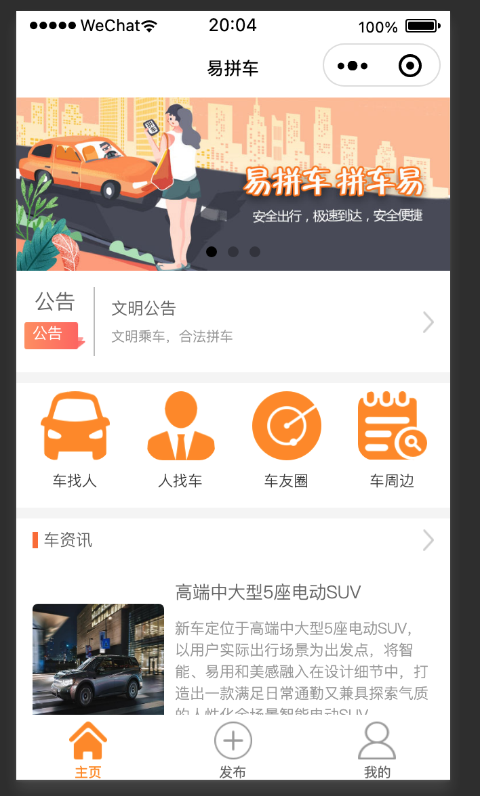

# carpool-weixin-app
拼车微信小程序


**carpool-weixin-app**: 是拼车小程序项目。

## 项目背景
**carpool-weixin-app** 是2018~2109年的时候，微信小程序比较火的时候，想着赶波热度写的一个拼车程序。程序整体的功能包括了拼车模块、圈子模块、车周边模块
和基础支撑模块。 本来想着投入商业运营的，不过正好赶上微信平台对小程序资质审核加强的阶段，所以就搁置了。 项目整体流程没有什么大问题，界面也算比较美
观。 由于项目是个人项目，工作之余，写的也比较匆忙并没有经过严谨的测试，所以想在此基础上二次开发使用的，还需要多测测。

## 项目功能截图

 

## 项目结构
```
.
├── README.md
├── app.js  （全局对象）
├── app.json （全局配置）
├── app.wxss
├── assets  （插件）
├── components （组件库）
├── config （全局配置）
├── doc （文档信息）
├── img （辅助图片）
├── lib  （第三方库）
├── pages (功能页面)
├── project.config.json
├── services （接口逻辑处理）
├── sitemap.json
├── static （静态文件）
├── tree.txt
└── utils （工具包）
```

## 关联项目
**carpool-api**

<a href="https://github.com/songhx/carpool" >[Git地址]</a>

      https://github.com/songhx/carpool

[Gitee地址]


# License
[Apache 2.0 License.](LICENSE)